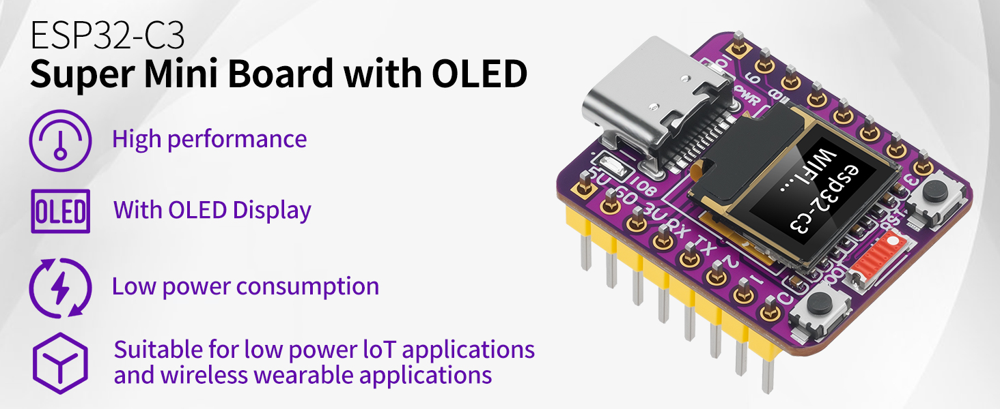
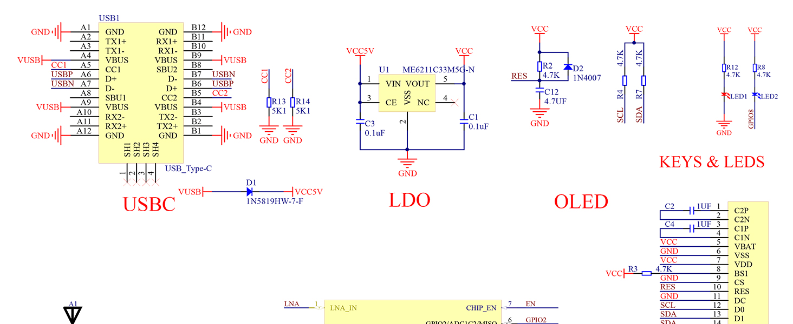
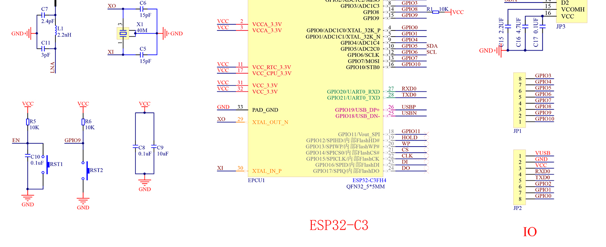
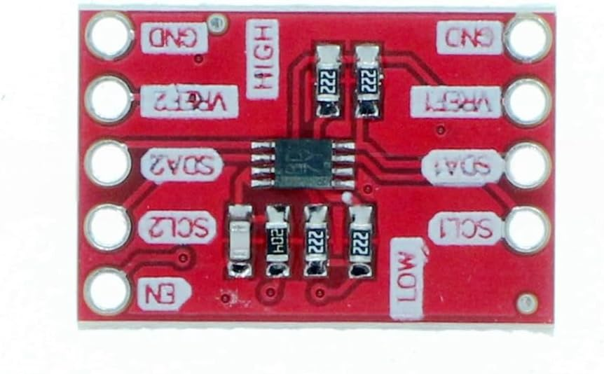
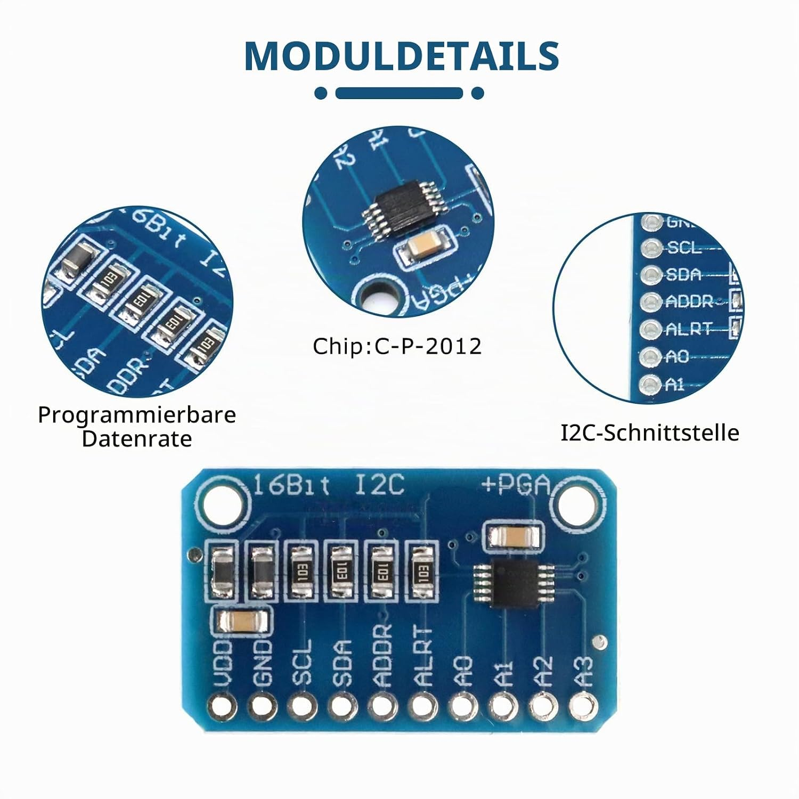

ESP32-C3 Hardware

https://www.amazon.de/dp/B0FP81HMYB?ref=ppx_yo2ov_dt_b_fed_asin_title&th=1

https://www.amazon.de/dp/B0GQ366TXQ?psc=1&smid=A2U2FOQYPPC984&ref_=chk_typ_imgToDp  

https://www.amazon.de/dp/B0D91XW41N?ref=ppx_yo2ov_dt_b_fed_asin_title

PIN-Belegung:

ESP32-C3 SuperMini
==================

GPIO5  ---> SDA OLED
         |
         +--> LV SDA I2C Pegelwandler

GPIO6  ---> SCL OLED
         |
         +--> LV SCL I2C Pegelwandler

3V3    ---> VCC OLED
         |
         +--> LV I2C Pegelwandler

5V     ---> VDD ADS1115
         |
         +--> HV I2C Pegelwandler

GND    ---> GND OLED
         |
         +--> GND ADS1115
         |
         +--> GND I2C Pegelwandler
         |
         +--> GND Wasserzaehler Reedkontakt
         |
         +--> GND Gaszaehler Reedkontakt

A0 ADS1115 ---> Drucksensor Signal

HV SDA I2C Pegelwandler ---> SDA ADS1115
HV SCL I2C Pegelwandler ---> SCL ADS1115

GPIO4 ---> Wasserzaehler Reedkontakt
GPIO3 ---> Gaszaehler Reedkontakt

Hinweis:
- Die `Reedkontakte` werden jeweils direkt zwischen GPIO und `GND` angeschlossen.
- Nicht gegen `3.3V` verdrahten, da in `Drucksensor.yaml` bereits `pullup: true` gesetzt ist.
- Der `ADS1115` laeuft auf `5V`, der `ESP32-C3` auf `3.3V`, deshalb wird dazwischen ein `I2C-Pegelwandler` benoetigt.

Schaltbild: 

          ESP32-C3 SuperMini

               3V3
                |
        +-------+------------------+
        |                          |
      OLED                    I2C Pegelwandler
      VCC                     LV

               5V
                |
             ADS1115
             VDD

               GND
                |
        +-------+-----------+--------------+--------------+
        |                   |              |              |
      OLED               ADS1115      Wasser Reed     Gas Reed
      GND                GND          Kontakt         Kontakt
                         |
                         +---- I2C Pegelwandler GND

GPIO5 (SDA)
    |
    +----- OLED SDA
    |
    +----- LV SDA I2C Pegelwandler
                 |
                 +----- HV SDA ---> ADS1115 SDA

GPIO6 (SCL)
    |
    +----- OLED SCL
    |
    +----- LV SCL I2C Pegelwandler
                 |
                 +----- HV SCL ---> ADS1115 SCL

GPIO4
    |
    +----- Wasser Reedkontakt
                 |
                 +----- GND

GPIO3
    |
    +----- Gas Reedkontakt
                 |
                 +----- GND

    
